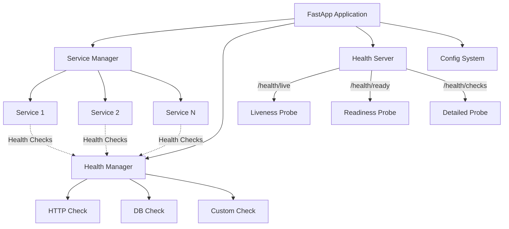
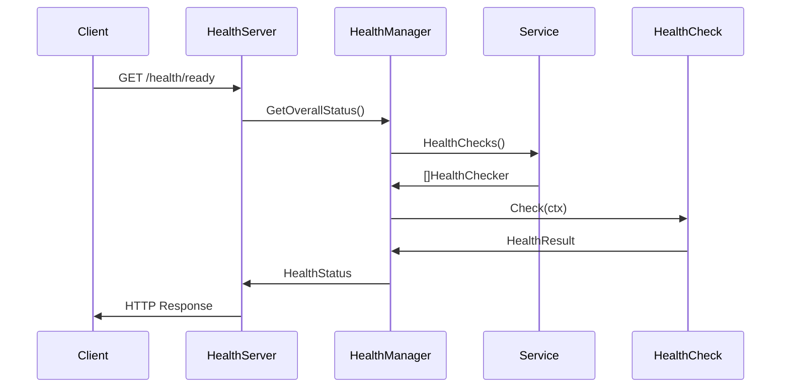

# FastApp Architecture

This document describes the architecture and design principles of FastApp.

## Design Principles

### 1. Simplicity First
- Minimal boilerplate code
- Intuitive API design
- Clear separation of concerns
- Sensible defaults

### 2. Production Ready
- Graceful shutdown handling
- Comprehensive health checks
- Observability built-in
- Error handling and recovery

### 3. Extensibility
- Plugin-friendly architecture
- Interface-based design
- Dependency injection support
- Configurable components

### 4. Performance
- Minimal overhead
- Efficient resource usage
- Concurrent execution
- Optimized for cloud environments

## Core Components

### Application (`fastapp.App`)

The main application container that orchestrates all services and components.

```go
type App struct {
    config        Config
    opts          options
    runners       []Runner
    healthManager *health.Manager
    healthServer  *server.Server
}
```

**Responsibilities:**
- Service lifecycle management
- Graceful shutdown coordination
- Health check orchestration
- Configuration management

### Service Interface

All services must implement the `Service` interface:

```go
type Service interface {
    Run(ctx context.Context) error
    Shutdown(ctx context.Context) error
}
```

**Optional Interfaces:**
- `HealthProvider` - Provide health checks
- `ReadinessController` - Control readiness state

### Health System

The health system consists of several components:

#### Health Manager
- Coordinates all health checks
- Manages caching and aggregation
- Controls overall readiness state

#### Health Checkers
- Individual health check implementations
- Built-in checks for common dependencies
- Custom check support

#### Health Server
- HTTP endpoints for health probes
- Kubernetes-compatible responses
- Detailed health information

### Configuration System

Type-safe configuration management with:
- Struct-based definitions
- Environment variable binding
- Default value support
- Validation capabilities

## Component Interaction



## Service Lifecycle

### 1. Initialization Phase
```go
app := fastapp.New(config)
app.Add(service1)
app.Add(service2)
```

- Application container created
- Services registered
- Health checks collected
- Configuration validated

### 2. Startup Phase
```go
app.Start()
```

- Health server started
- Services started concurrently
- Graceful shutdown handlers registered
- Application marked as ready

### 3. Runtime Phase
- Services execute their main logic
- Health checks run periodically
- Metrics collected
- Logs generated

### 4. Shutdown Phase
- Shutdown signal received
- Services notified to stop
- Graceful shutdown timeout applied
- Resources cleaned up

## Health Check Architecture

### Check Types

1. **Liveness Checks**
   - Process health verification
   - Always returns healthy if process is running
   - Used for container restart decisions

2. **Readiness Checks**
   - Service readiness verification
   - Considers all health check results
   - Used for traffic routing decisions

3. **Component Checks**
   - Individual dependency health
   - Database, cache, external APIs
   - Custom business logic checks

### Aggregation Strategies

#### AllHealthyStrategy (Default)
```go
func (s *AllHealthyStrategy) Aggregate(results map[string]HealthResult) HealthStatus {
    // All checks must be healthy for overall healthy status
}
```

#### MajorityHealthyStrategy
```go
func (s *MajorityHealthyStrategy) Aggregate(results map[string]HealthResult) HealthStatus {
    // Majority of checks must be healthy
}
```

#### WeightedStrategy
```go
func (s *WeightedStrategy) Aggregate(results map[string]HealthResult) HealthStatus {
    // Considers component importance (Critical, Important, Optional)
}
```

### Health Check Flow



## Configuration Architecture

### Configuration Loading

```go
type Config struct {
    App         fastapp.Config
    Database    DatabaseConfig
    Redis       RedisConfig
    CustomApp   CustomConfig
}

cfg, err := configloader.New[Config]()
```

### Environment Variable Binding

- Automatic struct field mapping
- Nested struct support
- Type conversion
- Default value handling

### Configuration Sources (Priority Order)

1. Environment variables
2. Configuration files
3. Default struct tags
4. Zero values

## Error Handling

### Panic Recovery

```go
defer func() {
    if r := recover(); r != nil {
        logger.Error(ctx, "Service panic recovered", "panic", r, "stack", debug.Stack())
        // Graceful degradation
    }
}()
```

### Graceful Degradation

- Non-critical service failures don't stop the application
- Health checks reflect component status
- Automatic retry mechanisms
- Circuit breaker patterns

## Observability

### Logging

- Structured logging with zap
- Context-aware logging
- Configurable log levels
- Request correlation IDs

### Metrics

- Prometheus metrics endpoint
- Application metrics
- Health check metrics
- Custom metrics support

### Tracing

- OpenTelemetry integration (planned)
- Distributed tracing
- Request flow tracking

## Security Considerations

### Health Endpoints

- Separate port for health checks
- No sensitive information exposure
- Rate limiting support
- Access control options

### Configuration

- Environment variable validation
- Sensitive data handling
- Configuration encryption support

## Performance Characteristics

### Memory Usage

- Minimal base overhead (~10MB)
- Efficient health check caching
- Garbage collection friendly
- Memory leak prevention

### CPU Usage

- Concurrent service execution
- Non-blocking health checks
- Efficient goroutine management
- CPU-bound task optimization

### Network

- HTTP/2 support
- Connection pooling
- Timeout management
- Retry mechanisms

## Extension Points

### Custom Health Checks

```go
type CustomChecker struct {
    name string
    checkFunc func(context.Context) health.HealthResult
}

func (c *CustomChecker) Name() string { return c.name }
func (c *CustomChecker) Check(ctx context.Context) health.HealthResult {
    return c.checkFunc(ctx)
}
```

### Custom Services

```go
type CustomService struct {
    // Service implementation
}

func (s *CustomService) Run(ctx context.Context) error {
    // Service logic
}

func (s *CustomService) Shutdown(ctx context.Context) error {
    // Cleanup logic
}
```

### Middleware Support (Planned)

- Request/response middleware
- Authentication middleware
- Rate limiting middleware
- Logging middleware

## Best Practices

### Service Design

1. **Single Responsibility** - Each service should have one clear purpose
2. **Stateless Design** - Minimize shared state between services
3. **Graceful Shutdown** - Always implement proper cleanup
4. **Health Checks** - Provide meaningful health indicators

### Configuration

1. **Environment Specific** - Use environment variables for deployment-specific values
2. **Validation** - Validate configuration at startup
3. **Secrets Management** - Use secure methods for sensitive data
4. **Documentation** - Document all configuration options

### Error Handling

1. **Fail Fast** - Detect and report errors early
2. **Graceful Degradation** - Continue operating with reduced functionality
3. **Retry Logic** - Implement appropriate retry mechanisms
4. **Circuit Breakers** - Prevent cascade failures

## Future Enhancements

### Planned Features

- [ ] Named services and selective running
- [ ] Dependency injection container
- [ ] Configuration hot reload
- [ ] Enhanced metrics and tracing
- [ ] Plugin system
- [ ] Service discovery
- [ ] Load balancing
- [ ] Rate limiting

### Roadmap

See [ROADMAP.md](../ROADMAP.md) for detailed development plans and timelines.
